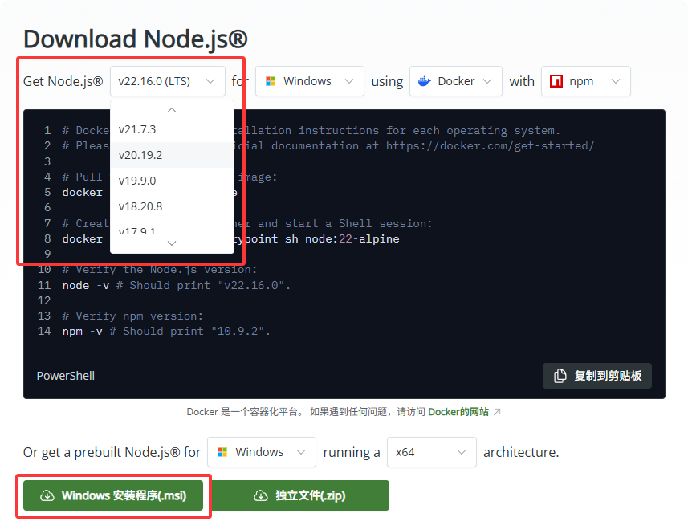

# 安装 bolt-cep

如前一章所述，我们需要一系列开发环境和工具来开始。

本章将引导你一步步搭建开发环境，其中包含了 `bolt-cep` 的安装。

## 安装 Node.js

Node.js 的安装通常有两种方法：

1.  直接从 Node.js 官网下载安装包进行安装：[https://nodejs.org/zh-cn/download](https://nodejs.org/zh-cn/download)
2.  使用 nvm（Node Version Manager）进行安装：[https://github.com/coreybutler/nvm-windows](https://github.com/coreybutler/nvm-windows)

**推荐使用第二种安装方式，即通过 nvm 进行安装。** nvm 是一个强大的 Node.js 版本管理工具，它允许你便捷地在不同 Node.js 版本之间进行切换。这对于需要处理依赖不同 Node.js 版本的多个项目来说，是非常必要的。

### 方法一：从官网下载安装包安装



1.  访问 Node.js 官网下载页面。通常建议选择 **LTS (长期支持) 版本**，因为它更稳定。
2.  在 "Or get a prebuilt Node.js for [系统类型] running a [处理器架构] architecture" 部分，根据你的操作系统类型（如 Windows、macOS）和处理器架构（如 x64、ARM64）选择对应的安装包。
3.  下载安装包后，双击运行并按照提示完成安装。

### 方法二：使用 nvm 安装

#### 通过 winget (Windows 包管理器) 安装

如果你的 Windows 系统支持 `winget` 命令（通常在 Windows 10 1809 (内部版本 17763) 或更高版本中内置），你可以直接通过命令行安装 `nvm`。

首先，建议更新 `winget` 软件源以获取最新软件包信息：

```bash
winget source update
```

然后，安装 `nvm`：

```bash
winget install CoreyButler.NVMforWindows
```

#### 手动下载安装包安装 (无 winget)

:::caution 注意
在安装 `nvm` 之前，请务必检查你的计算机上是否已安装 Node.js。如果已经安装，请先将其完全卸载。否则，Node.js 的现有安装可能会与 `nvm` 产生冲突，导致不可预知的错误。
:::

1.  访问 nvm-windows 的 GitHub 发布页面，下载最新版本的 `nvm-setup.exe` 文件：[https://github.com/coreybutler/nvm-windows/releases/latest](https://github.com/coreybutler/nvm-windows/releases/latest)
2.  双击运行下载的安装包。在安装向导中：
    *   同意许可协议。
    *   选择 `nvm` 的安装路径。
    *   选择 Node.js 符号链接（symlink）的存放路径。
    *   通常情况下，你可以选择默认设置，一路点击“下一步”完成安装。

#### 验证 nvm 安装

安装完成后，请打开 **命令提示符 (cmd)** 或 **PowerShell**。输入 `nvm` 命令并按回车键：

```bash
C:\Users\springlight>nvm

Running version 1.2.2.
——此处省略命令行参数——
```

如果你看到类似 "Running version 1.2.2." 的版本信息，说明 `nvm` 已成功安装。

#### 使用 nvm 安装 Node.js

接下来，你可以使用 `nvm` 来安装和管理 Node.js 版本。

查看已安装的 Node.js 版本列表：

```bash
C:\Users\springlight>nvm list

    21.7.3
  * 20.19.2 (Currently using 64-bit executable)
    18.20.8
```

如果你是首次安装 `nvm`，此列表可能为空。

使用 `nvm install [version]` 命令安装你需要的 Node.js 版本（例如，安装 Node.js 20 LTS 版本）：

```bash
nvm install 20
```

安装完成后，你可以使用 `nvm use [version]` 命令来切换到你刚刚安装的 Node.js 版本：

```bash
nvm use 20
```

## 安装 bolt-cep

安装 `bolt-cep` 之前，请确保你已经安装了 Node.js 环境。

### 安装 yarn

`bolt-cep` 的模板生成器依赖于 `yarn`，所以我们需要先安装它。

```bash
npm install -g yarn
```

### 使用 yarn create 创建项目

`yarn create` 命令可以快速创建一个新项目，包括 `bolt-cep` 的模板。

```bash
yarn create bolt-cep
```

如果你想要安装其他版本的 `bolt-cep`，可以使用 `npm create bolt-cep@[version]` 安装，`yarn create` 貌似会出现一些问题。

```bash
npm create bolt-cep@[version]
```

关于版本号，你可以前往 [npmjs](https://www.npmjs.com/package/bolt-cep?activeTab=versions) 网站查询。

按照提示输入项目名称、描述、作者、版本等信息，然后等待项目创建完成。

```bash
T   create-bolt-cep
│   by Hyper Brew | https://hyperbrew.co
|
*  Where do you want to create your project? # 输入项目名称
|  ./test-project
|
*  Which UI framework would you like to use? # 选择 UI 框架
|    Svelte
|    React
|    Vue
|
*  Which [UI framework] template would you like to start with? # 选择项目模板
|   # Demo 意味着使用所有应用的模板，包括 After Effects、Premiere、Photoshop 等等。
|   # Skeleton 意味着只使用选定的应用，没有示例 UI 或功能。
|   Demo (setup for all apps (After Effects, Premiere, Photoshop, etc) with sample functions and buttons)
|   Skeleton (only selected apps and no sample UI or functions)
|
*  Which Adobe apps do you want to support? 
|  # 如果选择 Skelton 模板，则可以选择 Adobe 应用。
|  # 按 space 键选择（可以多选），回车键确认选择。
|  [+] After Effects # 比如我要选择 After Effects
|  [ ] Premiere Pro
|  [ ] Photoshop
|  [ ] Illustrator
|  [ ] InDesign
|  [ ] Animate
|  [ ] Media Encoder
|  [ ] Bridge
|  [ ] Audition
|
*  What do you want to use as your panel's display name? # 输入面板显示名称
|  My Panel
|
*  What do you want to use as your panel's id? # 输入面板 ID
|  me.myname.mypanel
|
*  Do you want to install dependencies? (recommended) # 是否安装依赖项，建议选 Yes
|  > Yes /   No
```

从 `2.0.0` 版本开始，Demo 和 Skeleton 模板被移除，改为使用 `Keep Sample Code Snippets?` 选项来选择是否安装示例代码片段。

```bash
*  Keep Sample Code Snippets? # 是否保留示例代码片段
|  Yes /   No
```


接下来就会自动安装项目依赖项，并生成项目文件。