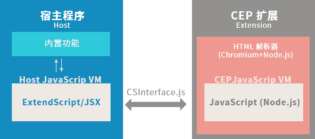
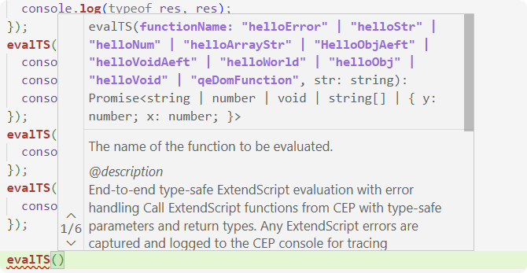

# EvalTS 与 EvalES 

:::info
本章将深入探讨 bolt-cep 中的两大核心 API：`EvalTS` 与 `EvalES`。
:::

## EvalTS 与 EvalES 是什么？

在深入了解这两个 API 之前，我们先看一下标准 CEP (Common Extensibility Platform) 的技术架构。

<div align="center">
  
</div>
<center>图片来源: <a href="http://blog.nullice.com/%E6%8A%80%E6%9C%AF/CEP-%E5%BC%80%E5%8F%91%E6%95%99%E7%A8%8B/%E6%8A%80%E6%9C%AF-CEP-%E5%BC%80%E5%8F%91%E6%95%99%E7%A8%8B-Adobe-CEP-%E6%89%A9%E5%B1%95%E5%BC%80%E5%8F%91%E6%95%99%E7%A8%8B-%E3%80%8C-2-%E3%80%8DCEP-%E6%8A%80%E6%9C%AF%E6%A6%82%E8%A7%88/" target="_blank" rel="noopener noreferrer">Adobe CEP 扩展开发教程 「 2 」CEP 技术概览</a></center>

<br/>

:::warning
此处的 `jsx` 并不是 React 的那个 `jsx`，而是 Adobe ExtendScript 的文件扩展名。
:::

宿主端 (Host)：
通过 ExtendScript 直接访问和控制 Adobe 应用程序的核心功能，如 After Effects 中的图层和合成。

CEP 端 (Extension)：
负责扩展的用户界面和交互（使用 Web 技术）。它通过 `evalScript` 执行宿主层脚本，并能使用 `addEventListener` 监听来自宿主层的事件。

<br/>

在 `bolt-cep` 框架中，上图所展示的 CEP 技术概览依然适用。然而，`bolt-cep` 在此基础上进行了诸多优化与封装：

1.  `CSInterface` 的封装：`bolt-cep` 将原生的 `CSInterface` 封装为 `csInterface.ts`，并基于此构建了多种便捷的工具类。`EvalTS` 和 `EvalES` 正是这些工具类的重要组成部分，它们位于 `js/lib/utils/bolt.ts` 文件中。
2.  前端视图的现代化：传统的 HTML 解析器和渲染部分，在 `bolt-cep` 项目中由现代前端框架（如 React、Vue 等）接管，提升了开发效率和用户体验。
3.  宿主脚本的编写方式革新：得益于 `bolt-cep` 的高度封装，开发者不再局限于使用传统的 ExtendScript (.jsx) 文件来编写宿主环境（Host端）的逻辑。现在，你可以直接在 `src/jsx` 目录下使用 TypeScript 编写代码，甚至可以运用部分 ES6 语法（尽管为了确保最佳兼容性和稳定性，建议贴近 ES3 的规范编写，更多请查阅 [别再“無路矢”！—— 部分编码约定](./ext_bolt-cep-donts.mdx)，其中有一些建议，例如 “谨慎使用展开语法”）。`bolt-cep` 会负责将这些 TypeScript 代码编译成宿主应用程序兼容的 ExtendScript。

那么，关键问题来了：在 CEP 环境中，我们如何调用这些运行在宿主应用程序（如 Photoshop, After Effects）环境内的 TypeScript/ExtendScript 函数呢？

`EvalTS` 和 `EvalES` 正是为解决这一跨环境通信问题而设计的。

## EvalTS

`EvalTS` 是 `bolt-cep` 提供的 `bolt.ts` 文件中的一个核心方法。它允许开发者在 CEP 端以类型安全的方式调用定义在 Host 端（宿主应用程序环境）的 TypeScript 函数。

让我们看一下 `EvalTS` 的方法签名：

```ts
export const evalTS = <
  Key extends string & keyof Scripts,
  Func extends Function & Scripts[Key]
>(
  functionName: Key,
  ...args: ArgTypes<Func>
): Promise<ReturnType<Func>>;
```

`EvalTS` 接收两个主要参数：

-   `functionName` (`Key`): 一个字符串，表示需要调用的 Host 端函数的名称。此名称必须是 `Scripts` 接口中定义的键，并且对应的值必须是一个函数类型。
-   `args` (`...ArgTypes<Func>`): 一个或多个参数，将按顺序传递给目标 Host 端函数。

`EvalTS` 的返回值是一个 `Promise` 对象。当 Host 端函数执行完毕后，该 Promise 会 resolve 并返回函数的执行结果；如果执行出错，则会 reject。

接下来，我们深入了解 `Scripts` 接口。该接口通常定义在 `src/jsx/index.ts` 文件中：

:::info
以下展示的是 Demo 项目中的 `Scripts` 接口定义。对于通过 Skeleton 模板创建的项目，此接口的内容会根据你在项目创建时所选择的 Adobe 应用程序而有所不同，不会默认包含所有模块。

从 2.0.0 版本开始，Demo 和 Skeleton 模板被移除，你现在需要指定 Adobe 应用，`bolt-cep` 会为你生成对应的 `Scripts` 接口。
:::

```ts title="src/jsx/index.ts"
export type Scripts = typeof aeft &
  typeof ame &
  typeof anim &
  typeof audt &
  typeof idsn &
  typeof ilst &
  typeof kbrg &
  typeof phxs &
  typeof ppro;
```

`Scripts` 接口是一个类型别名，它聚合了多个模块（如 `aeft`、`ame` 等）导出的所有可调用函数。例如，`aeft` 模块的导入方式如下：

```ts title="src/jsx/index.ts"
import * as aeft from "./aeft/aeft";
```

我们再追踪到 `aeft` 模块的具体实现，例如 `src/jsx/aeft/aeft.ts`：

```ts title="src/jsx/aeft/aeft.ts"
import {
  helloVoid,
  helloError,
  helloStr,
  helloNum,
  helloArrayStr,
  helloObj,
} from "../utils/samples";
export { helloError, helloStr, helloNum, helloArrayStr, helloObj, helloVoid };
import { dispatchTS } from "../utils/utils";

export const helloWorld = () => {
  alert("Hello from After Effects!");
  app.project.activeItem;
};
```

为了让 `EvalTS` 能够识别并调用我们在 Host 端定义的函数，有以下几种推荐的导出方式：

1.  **直接 `export` 导出函数（推荐）**：
    ```ts
    // 在例如 aeft.ts 或其他模块文件中
    import { myTestFunction } from "../springlightTraces"; // 假设函数在别处定义
    export { myTestFunction };
    // 也可以使用别名导出
    export { myTestFunction as myTestFunctionAeft };
    ```

2.  **直接在模块文件（如 `aeft.ts`）中定义并导出**：
    ```ts 
    // 在例如 aeft.ts 文件中
    export const myTestFunction = () => {
      // 函数具体实现
    };
    ```

3.  **重定向导出**：
    ```ts
    // 在例如 aeft.ts 文件中
    import { myTestFunction } from "../springlightTraces";
    export const myTestFunctionAeft = myTestFunction; // 将导入的函数以新名称导出
    ```

完成函数定义和导出后，我们可以验证 `EvalTS` 是否能正确识别。在 CEP 端的代码中，当输入 `evalTS("` 时，Visual Studio Code 等支持 TypeScript 的编辑器通常会提供自动补全提示，列出所有可用的函数名：

<div align="center">
  
</div>

如上图所示，`functionName` 的提示中已包含了我们定义的函数。

现在，我们可以实际调用 `EvalTS`。例如，Host 端有一个如下函数：

```ts title="Host 端 (src/jsx/aeft/aeft.ts)"
export const helloArrayStr = (arr: string[]) => {
  alert(
    `ExtendScript received an array of ${arr.length} strings: ${arr.toString()}`
  );
  return arr;
};
```

在 CEP 端调用它：

```ts title="CEP 端 (src/js/main/main.vue)"
evalTS("helloArrayStr", ["kira", "kira", "doki", "doki"]).then((result) => {
  console.log(result); // ["kira", "kira", "doki", "doki"]
}).catch(error => {
  console.error("Error calling helloArrayStr:", error);
});
```
请注意，由于 `EvalTS` 返回的是 Promise，我们需要使用 `.then()` 来处理成功的结果，并推荐使用 `.catch()` 来捕获潜在的错误。

## EvalES

如果你有标准 CEP 开发经验，那么对 `evalScript()` 方法一定不陌生。该方法允许在 CEP 端执行任意 ExtendScript 代码字符串。

`EvalES` 在功能上与原生的 `evalScript()` 类似，但它是 `bolt-cep` 针对其工作流特别封装和优化过的版本。

我们来看看 `EvalES` 的方法签名和核心实现：

```ts
export const evalES = (script: string, isGlobal = false): Promise<string> => {
  return new Promise(function (resolve, reject) {
    const pre = isGlobal
      ? ""
      : `var host = typeof $ !== 'undefined' ? $ : window; host["${ns}"].`;
    const fullString = pre + script;
    csi.evalScript(
      "try{" + fullString + "}catch(e){alert(e);}",
      (res: string) => {
        resolve(res);
      }
    );
  });
};
```

`EvalES` 接收两个参数：

-   `script` (`string`): 需要在 Host 端执行的 ExtendScript 代码字符串。
-   `isGlobal` (`boolean`, 可选, 默认为 `false`): 指示脚本是否在全局作用域中执行。若为 `false`，脚本通常会在一个特定的命名空间下执行，以避免污染全局环境。

`EvalES` 的返回值同样是一个 `Promise`，它会在脚本执行完毕后 resolve 并返回执行结果（通常是脚本最后一条语句的返回值，或通过特定方式返回的值，以字符串形式）。

`EvalES` 的实现原理是对 `CSInterface` 的 `evalScript()` 方法进行了包装。在执行脚本前，它会根据 `isGlobal` 参数决定是否添加命名空间前缀，并且自动为脚本包裹了 `try-catch` 块，以便更好地捕获和处理 Host 端脚本执行时发生的错误。

从根本上说，`EvalES` 和 `EvalTS` 的目标相似：都是在 CEP 端触发 Host 端代码的执行。由于 `EvalTS` 调用的 TypeScript 函数最终也会被编译成 ExtendScript，因此 `EvalES` 理论上也能调用这些编译后的函数。

然而，两者各有侧重：

-   **`EvalTS`**：专为调用 TypeScript 函数设计，通过泛型和 `Scripts` 接口提供了类型安全和更好的开发体验（如编辑器自动补全、编译时检查）。它不能直接执行任意的 ExtendScript 代码片段。
-   **`EvalES`**：更加灵活，允许执行任意的 ExtendScript 代码字符串。这在需要动态构造脚本或调用未在 `Scripts` 接口中定义的底层 ExtendScript 功能时非常有用。

`EvalTS` 的类型约束 `Key extends string & keyof Scripts, Func extends Function & Scripts[Key]` 是其核心优势，它极大地提升了调用 Host 端函数的便捷性和可靠性。


## Hello World！

以下是一个简单的示例，展示了如何在 CEP 端调用来自 Host 端的函数：

```ts title="Host 端，src/jsx/aeft/aeft.ts"
export const helloWorld = () => {
  return "Hello from After Effects!";
};
```

```ts title="CEP 端，src/js/main/main.vue"
<script setup lang="ts">
import { evalTS } from "../lib/utils/bolt";

const helloWorldTS = () => {
  evalTS("helloWorld").then((result) => {
    alert(result); // "Hello from After Effects!"
  });
}

const helloWorldES = () => {
  evalES("helloWorld").then((result) => {
    alert(result); // "Hello from After Effects!"
  }
}

</script>
<template>
  <button @click="helloWorldTS">Click me</button>
  <button @click="helloWorldES">Eval ES</button>
</template>
```

这是一个非常简单的示例，但是它展示了 EvalTS 以及 EvalES 的基本用法。

## 编码约定

请阅 [别再“無路矢”！—— 部分编码约定](./ext_bolt-cep-donts.mdx)。

编码约定是指在开发过程中，我们需要遵守的一些规范或规则，以确保代码的可维护性、可读性和可扩展性。同时，也可以防止你踩坑（此章一开始就叫`部分避坑指南`）。

请一定要看！（来自写者的建议）


## 更好的调试

从 `bolt-cep` 1.3.1 版本开始，`evalTS().catch()` 允许你捕获一个包含详细信息的错误对象：

```json
{
  "end": 0,
  "fileName": "E:\\springlight-traces\\dist\\cep\\jsx\\index.js",
  "line": 331,
  "message": "throw a error :)",
  "name": "Error",
  "number": 1,
  "source": "(function (thisObj) {↵// ----- EXTENDSCRIPT INCLUD……", // index.js 内容
  "end": 0
}
```

你可以结合其中的 `line` 和 `fileName` 信息，直接定位到编译后的 `index.js` 文件中出错的具体位置，然后再返回 TypeScript 源码进行修复。不过，这一切的前提是，你没有在 `cep.config.ts` 文件中将 `jsxbin` 设置为 `replace`。该设置会使用混淆后的 `jsxbin` 格式替换 `index.js` 文件，导致无法进行文件定位。

此外，`bolt-cep` 在 `cep.config.ts` 中默认将 `build` 中的 `sourceMap` 设置为 `true`，用于生成 `index.js.map` 文件。通过各类 Source Map 解析工具，你可以利用此文件，将 `index.js` 中的某一行代码精确映射回它在 TypeScript 源代码中的原始位置。

## 总结

`EvalTS` 和 `EvalES` 是 `bolt-cep` 框架中用于实现 CEP 端与 Host 端通信的核心 API。

-   **`EvalTS`** 提供了类型安全、易于使用的方式来调用在 Host 端用 TypeScript 定义的函数，是日常开发中的首选。
-   **`EvalES`** 提供了更底层的灵活性，允许直接执行 ExtendScript 代码字符串，适用于特定场景。

在实际开发中，我们应优先选择 `EvalTS`，因为它提供了更高的可靠性和可维护性。