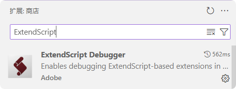
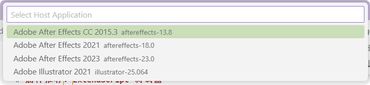
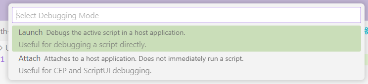

# ExtendScript 调试器

在你开始学习和使用 ExtendScript 进行开发之前，我强烈推荐一款 Visual Studio Code 插件：[ExtendScript Debugger](https://marketplace.visualstudio.com/items?itemName=Adobe.extendscript-debug)。

这款插件能帮助你连接到 Adobe 应用程序（宿主程序）的 ExtendScript 引擎，从而直接在 Visual Studio Code 中进行脚本调试、运行脚本以及查看调试控制台。对于 `bolt-cep` 这样的现代 CEP 开发流程，调试控制台功能尤其常用。

## 安装与配置步骤

1.  **安装插件**：
    首先，在 Visual Studio Code 的“扩展”视图（通常在侧边栏）中搜索 `ExtendScript Debugger`，然后点击“安装”按钮。

    <center>
    
    </center>

2.  **启动调试会话**：
    安装完成后，你可以通过以下任一方式启动调试：
    *   直接按下 `F5` 快捷键。
    *   点击侧边栏的“运行和调试”图标，然后在顶部的下拉菜单中选择 “ExtendScript Debugger” 作为调试器。

3.  **选择目标 Adobe 应用程序**：
    接下来，VS Code 会提示你 `Select Host Application`（选择宿主应用程序）。理论上，列表中会显示你计算机上已安装的所有 Adobe 应用程序。

    <center>
    
    </center>

    *   **注意**：便携版 (Portable) 的 Adobe 应用程序可能不会被自动检测到。
    *   **故障排除**：如果你发现已安装的某个 Adobe 应用程序未出现在列表中，请先确认它是否为便携版。如果不是便携版导致的问题，尝试重新安装该 Adobe 应用程序或 VS Code 插件本身，有时能解决此问题。

4.  **重要前提：启动 Adobe 应用程序**：
    在选择目标 Adobe 应用程序之前，**请务必确保对应的 Adobe 应用程序已经启动**，否则插件将无法成功连接到其 ExtendScript 引擎。

5.  **选择调试模式**：
    <center>
    
    </center>
    成功选择宿主应用程序后，插件会提供以下两个主要的调试模式选项：
    *   **`Launch` (在 ExtendScript 引擎中启动脚本)**：
        如果你当前在 VS Code 中编辑的是一个标准的 ExtendScript 文件（通常是 `.jsx` 文件，例如用于 CEP 扩展开发中的脚本），那么选择此选项。插件会在选定的 Adobe 应用程序中执行当前脚本，并允许你进行调试。
    *   **`Attach` (附加到 ExtendScript 引擎)**：
        此选项会直接连接到目标 Adobe 应用程序的 ExtendScript 引擎。这使你可以查看调试控制台的输出（例如 `$.writeln` 的信息）、捕获运行时错误以及检查变量状态等，而无需特地启动某个脚本文件。这对于监控和调试已在运行或由其他方式触发的脚本非常有用。

## 部署 `launch.json` 

你还可以通过在项目根目录下创建或编辑 `.vscode/launch.json` 文件来自定义和保存调试配置。选择 ExtendScript 的预设配置可以快速开始：

```json
{
    // 使用 IntelliSense 了解相关属性。
    // 悬停以查看现有属性的描述。
    // 欲了解更多信息，请访问: https://go.microsoft.com/fwlink/?linkid=830387
    "version": "0.2.0",
    "configurations": [
        {
            "type": "extendscript-debug",
            "request": "attach",
            "name": "Attach to ExtendScript Engine"
        },
        {
            "type": "extendscript-debug",
            "request": "launch",
            "name": "Launch Script in ExtendScript Engine"
        }
    ]
}
```

---

在下一章中，我们将开始学习基础的 ExtendScript API，从常用的 `$.writeln` 函数讲起，以及一些该插件的功能。
