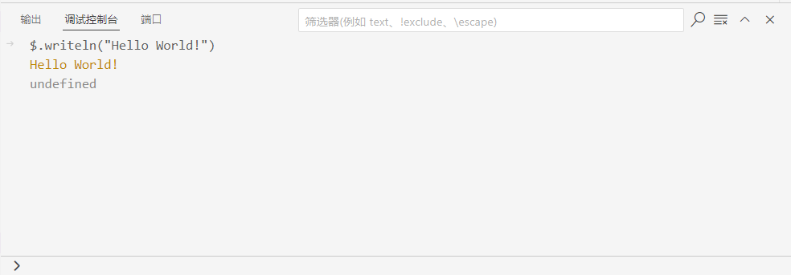

# 日志 —— $.writeln

在 ExtendScript 中，`$` [查看文档](/api/shared/JavaScript/interfaces/$) 是一个非常重要的全局对象，它提供了一系列实用的内置功能。其中，`$.writeln` 方法尤为常用，主要负责在 ExtendScript 的控制台输出信息。

## `$.writeln` 方法详解

[\$.writeln](/api/shared/JavaScript/interfaces/\$#writeln) 方法能够向控制台输出指定的文本内容，并在每次输出后自动添加一个换行符。

**宿主端 (Host) 示例 - `src/jsx/aeft/aeft.ts`**
```ts
export function logConsole(message: string) {
    $.writeln(message); // 输出信息并换行
}
```

**CEP 端示例 - `src/js/main/main.vue`**
```ts
<script setup lang="ts">
import { evalTS } from "../lib/utils/bolt"; // 导入 evalTS 方法

const logConsole = (message: string) => {
    evalTS("logConsole", message); // 调用宿主端的 logConsole 方法
};
</script>

<template>
  <button @click="logConsole('Hello, world!')">点击记录日志</button>
</template>
```

此外，`$` 对象还拥有一个 `$.write` 方法，它与 `$.writeln` 类似，区别在于 `$.write` 输出文本后不会自动换行。由于本篇主要聚焦于 `$.writeln`，因此对 `$.write` 不再做过多阐述。

## 如何查看控制台日志？

要查看 `$.writeln` 或 `$.write` 输出的日志，你需要借助 ExtendScript 调试插件。当插件成功连接到 Adobe 宿主应用程序（如 Photoshop, Illustrator, After Effects 等）后，请切换到调试模式，并打开调试控制台。此时，所有通过上述方法输出的日志信息便会清晰地展示出来。

<center>

</center>

值得一提的是，正如上图所示，ExtendScript Debugger 的调试控制台具备一项强大功能：它允许你直接输入并执行 ExtendScript 代码片段。这与在现代浏览器的开发者工具中执行 JavaScript 代码非常相似，你可以即时看到代码的运行结果和输出。

不仅如此，你还可以直接在控制台中输入一个对象变量名，然后按下回车键。调试器便会展示该对象的所有属性和方法，极大地方便了调试和探索过程。

更多关于 `$` 的方法，变量等，请参考 [\$ 接口文档](/api/shared/JavaScript/interfaces/\$)。