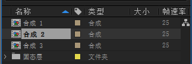

# 项目 —— `app.project`

:::tip
本章内容仍在逐步完善与更新中，更多精彩敬请期待！
:::

在开发 AE 插件时，经常会遇到需要获取合成中的图层或对图层进行操作的需求。`app.project` 对象正是实现这些功能的核心。

`app.project` 是 After Effects 的项目对象，代表了当前活动的项目。它储存了许多有用的信息和可调用的方法，例如：

-   `app.project.activeItem`：指向当前活动项，通常是一个合成（`CompItem`）。
-   `app.project.file`：表示当前项目文件的磁盘位置。

更多关于 `app.project` 对象的详细信息，可以查阅 [接口文档](../api/AfterEffects/22.0/classes/Project)。

## 获取当前合成

我们可以通过 `app.project.activeItem` 属性来获取项目中的当前活动项。

`app.project.activeItem` 返回的是 `_ItemClasses` 对象，`_ItemClasses` 是一个联合类型，代表了可能的活动项目类型。

-   如果当前项目没有活动项，则返回 `null`
-   如果你在 `项目` 页面中，选择了一个文件夹，则返回 `FolderItem` 对象
-   如果你在 `项目` 页面中，选择了一个合成，则返回 `CompItem` 对象
-   如果你在 `项目` 页面中，选择了一个纯色、视频、图片或音频等素材，则返回 `FootageItem` （素材项）对象
-   如果你在 `项目` 页面中，多选了项目，则返回 `null`

-   同时，如果你正在查看/编辑一个合成，或一个纯色、视频、图片或音频等素材，则 `app.project.activeItem` 也会返回相应的对象。

为了确保代码的健壮性并遵循良好的编码实践，当我们需要获取一个合成对象时，必须检查 `app.project.activeItem` 的返回类型是否确实为 `CompItem`，以避免潜在的 `null` 引用或类型错误。

```ts
const comp = app.project.activeItem; // 指定类型

if (!(comp instanceof CompItem)) { // 建议同时检查 !comp 以处理 null 的情况
    throw new Error("当前项目没有合成"); // 抛出错误
}

const name = comp.name; // 获取合成名称
```

## 获取用户选择项

通过 `app.project.selection` 属性，我们可以获取用户在项目面板中当前选择的一个或多个项目。

<center></center>
<center>如图所示，用户在项目面板中的选择</center>

`app.project.selection` 返回的是 `_ItemClasses[]` 类型，`_ItemClasses[]` 是一个联合类型，可以表示各种项目类型。

-   选择一个文件夹，会返回 `FolderItem` 对象
-   选择一个合成，会返回 `CompItem` 对象
-   选择纯色、视频、图片或音频等素材，则会返回 `FootageItem` （素材项）对象

如果选择多个项目，则会将相应的对象放入数组中。

-   选择一个文件夹，选择一个合成，会返回 `[FolderItem],[CompItem]` *从 ExtendScript Debugger 得知*

如果用户选择了一个控件，会返回一个没有名字的类型（从ExtendScript Debugger得知）

要全面了解 `app.project.selection` 可能返回的各种类型，建议利用 ExtendScript Debugger 的调试控制台进行实际测试和探索。

```ts
const selection = app.project.selection; // 获取选择项数组

// 如果只希望用户只可以选择一个项目
if (selection.length !== 1 || !(selection[0] instanceof CompItem)) {
    throw new Error("请选择一个合成"); // 抛出错误
}

const selectedComp = selection[0]; // 获取选中的合成
let name = selectedComp.name; // 获取合成名称
```

## 导入文件

After Effects 的 ExtendScript 提供了两种主要方式来导入文件：

1.  **`app.project.importFile()`**

    此方法允许以编程方式导入文件。它需要一个 `ImportOptions` 对象作为参数，用以指定诸如文件路径、导入类型（素材、项目、带图层裁切的合成等）以及其他导入设置。成功后，该方法会返回一个代表新导入项目的对象（可能是 `CompItem`、`FootageItem` 或 `FolderItem`），方便后续的脚本处理。

    ```ts
    let importOptions = new ImportOptions(new File("/path/to/your/file.mp4"));
    // 更多 ImportOptions 设置:
    // importOptions.importAs = ImportAsType.FOOTAGE; // 导入类型
    // importOptions.sequence = false; // 是否作为序列导入
    // importOptions.forceAlphabetical = true; // 是否按字母顺序排序

    const importedItem = app.project.importFile(importOptions);

    if (importedItem instanceof FootageItem) {
        $.writeln(importedItem.frameRate); // 获取素材的帧率
    }
    ```

    关于 `ImportAsType` 的更多信息，请参考 [接口文档](../api/AfterEffects/22.0/classes/ImportOptions)。

    这种直接导入的方式非常适合于导入路径固定或由插件自身生成的素材。

2.  **`app.project.importFileWithDialog()`**

    如果希望由用户来选择需要导入的文件，可以调用 `app.project.importFileWithDialog()`。该方法会向用户弹出一个标准的系统文件选择对话框。

    用户完成文件选择后，此方法会返回一个包含新导入项目对象的数组（即使只导入了一个文件，通常也返回含单个元素的数组）。由于导入决策由用户做出，返回对象的具体类型（`FootageItem`、`CompItem`、`FolderItem` 等）在编码时是不可预知的。因此，对返回结果进行仔细的类型检查和处理至关重要。

    ```ts
    const importedItems = app.project.importFileWithDialog(); // 返回一个数组

    // 如果你只想让用户导入一个文件
    if (!importedItems.length === 1) {
        throw new Error("请选择一个文件"); // 抛出错误
    }

    const comp = importedItems[0]; // 获取导入的合成

    // 如果你希望导入的项目是合成
    if (!(comp instanceof CompItem)) {
        throw new Error("导入的不是合成"); // 抛出错误
    }

    $.writeln(comp.name); // 获取合成名称
    ```

当然，如果您在特定场景下只期望处理某种特定类型的导入项（例如，只处理合成），可以针对性地进行类型判断，并对不符合预期的类型执行相应的错误处理或流程控制。