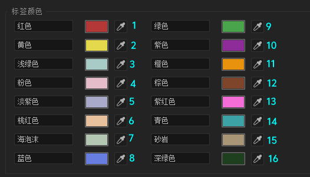

# 合成 —— CompItem

:::tip
本章内容仍在逐步完善与更新中，更多精彩敬请期待！
:::

在上一章中，我们学习了如何通过 `app.project.activeItem` 来获取当前活动合成。本章将深入探讨如何进一步操作合成对象（CompItem），包括获取和修改其内部的各种属性与内容。

若想了解 `CompItem` 对象的完整信息，请查阅[接口文档](../api/AfterEffects/22.0/classes/CompItem)。

### 合成背景颜色

<center>

</center>
<center>对应 `背景颜色`</center>
<br/>

合成的背景颜色可以通过 `CompItem` 对象的 `bgColor` 属性进行读取或设置。此属性的值类型为 `ThreeDColorValue`。

需要注意的是，这并非我们通常直接使用的 RGB 颜色值。要正确设置颜色，你需要将标准的 RGB 值（0-255范围）转换成 `ThreeDColorValue` 格式，即每个颜色分量都除以 `255`。

例如，RGB 颜色 `248,248,255` 转换为 `ThreeDColorValue` 就是将每个分量除以 `255`，得到 `[248 / 255, 248 / 255, 255 / 255]`，即 `[0.97254901960784, 0.97254901960784, 1]`。
```ts
const comp = app.project.activeItem;

if (!(comp instanceof CompItem)) {
    throw new Error("当前项目没有合成");
}

comp.bgColor = [248 / 255, 248 / 255, 255 / 255] // RGB 转 ThreeDColorValue
```

### 名称与标签颜色

你可以通过 `CompItem` 对象的 `name` 和 `labelColor` 属性分别获取或设置合成的名称和标签颜色。

```ts
const comp = app.project.activeItem;

if (!(comp instanceof CompItem)) {
    throw new Error("当前项目没有合成");
}

comp.name = "咕咕嘎嘎" // 设置合成名称
```

值得一提的是，`labelColor` 属性并非直接存储颜色值，而是通过一个 ID 来索引。这是因为 After Effects 允许用户自定义标签颜色，并提供了16个可供选择的标签 ID（这里示例中1代表红色）。

<center>

</center>
<center>标签颜色 ID 对照表</center>

<br/>
```ts
comp.labelColor = 1 // 设置标签颜色为红色（ID 为 1）
```

### 合成高度与宽度

通过 `CompItem` 对象的 `height` 和 `width` 属性，你可以轻松获取或设定合成的高度与宽度。

```ts
const comp = app.project.activeItem;

if (!(comp instanceof CompItem)) {
    throw new Error("当前项目没有合成");
}

comp.height = 1080 // 设置合成高度为1080
comp.width = 1920 // 设置合成宽度为1920
```

### 是否包含音频与视频

使用 `CompItem` 对象的 `hasAudio` 和 `hasVideo` 布尔属性，可以检查或设置合成是否包含音频轨道和视频内容。

```ts
comp.hasAudio = true // 设置合成包含音频
comp.hasVideo = false // 设置合成不包含视频
```

### 帧率与帧持续时间

合成的帧率和帧持续时间（即每帧的长度）可以通过 `CompItem` 对象的 `frameRate` 和 `frameDuration` 属性进行获取或设置。

```ts
comp.frameRate = 60 // 设置帧率为60fps
let frameDuration = comp.frameDuration; // 获取帧持续时间
```

### 合成ID

`CompItem` 对象的 `id` 属性用于获取该合成的唯一标识符。

```ts
let compId = comp.id; // 获取合成ID
```

### 选中的图层与属性

`CompItem` 对象提供了 `selectedLayers` 和 `selectedProperties` 属性，用于访问当前合成中被选中的图层和属性集合。

由于用户可以同时选择多个图层或属性，这两个属性返回的都是数组。如果你的脚本逻辑需要用户仅选择单个图层，可以通过检查返回数组的 `length` 属性来进行判断。

关于图层的详细操作，我们将在下一章展开讨论。

```ts
const selectedLayers = comp.selectedLayers;

// 如果你只想让用户选一个图层
if (selectedLayers.length !== 1) {
    throw new Error("请选择一个图层");
}

const layer = selectedLayers[0]; // 获取选中的第一个图层
```

对于 `selectedProperties`，获取到的属性是一个 `_PropertyClasses` 联合类型。可能包含 `Property`、`PropertyGroup` 或 `MaskPropertyGroup` 这三种类型。

因此，在处理 `selectedProperties` 返回的结果时，你需要根据具体需求，判断其具体类型并进行相应的操作。

```ts
const selectedProperties = comp.selectedProperties;

// 如果你只想让用户选一个属性
if (selectedProperties.length !== 1) {
    throw new Error("请选择一个属性");
}

// 假设我们期望选中的第一个属性是一个属性组 (PropertyGroup)
if (selectedProperties[0] instanceof PropertyGroup) {
    const name = selectedProperties[0].name // 获取属性组的名称
}
```

### 获取图层

`CompItem` 对象提供了 `layer(index: number)` 方法，用于根据索引获取合成中的图层。

:::info
注意：索引从1开始，即 `comp.layer(1)` 获取的是第一个图层。
:::

<center>

</center>
<center>图层索引号可以参考 `#`</center>
<br/>

```ts
const layer = comp.layer(1); // 获取第一个图层
```

### 添加图层

`CompItem` 对象提供了 `layers` 属性，`layers` 属性是一个 `LayerCollection` 对象，用于管理合成中的所有图层。

`LayerCollection` 对象提供了以下方法和属性：

```ts
/** The LayerCollection object represents a set of layers. The LayerCollection belonging to a CompItem object contains all the layer objects for layers in the composition. The methods of the collection object allow you to manipulate the layer list. */
declare class LayerCollection extends Collection {
  /** Retrieves a Layer object in the collection by its index number. The first object is at index 1. */
  readonly [index: number]: Layer

  /** Creates a new AVLayer and adds it to this collection. */
  add(item: AVItem, duration?: number): AVLayer

  /** Creates a new, null layer and adds it to this collection. */
  addNull(duration?: number): AVLayer

  /** Creates a new layer, a FootageItem with a SolidSource, and adds it to this collection. */
  addSolid(
    color: ThreeDColorValue,
    name: string,
    width: number,
    height: number,
    pixelAspect: number,
    duration?: number,
  ): AVLayer

  /** Creates a new paragraph (box) text layer and adds it to this collection. */
  addBoxText(size: [number, number], sourceText?: string | TextDocument): TextLayer

  /** Creates a new point text layer and adds it to this collection. */
  addText(sourceText?: string | TextDocument): TextLayer

  /** Creates a new camera layer and adds it to this collection. */
  addCamera(name: string, centerPoint: [number, number]): CameraLayer

  /** Creates a new light layer and adds it to this collection. */
  addLight(name: string, centerPoint: [number, number]): LightLayer

  /** Creates a new shape layer and adds it to this collection. */
  addShape(): ShapeLayer

  /** Retrieves the layer object with a specified name. */
  byName(name: string): Layer | null

  /** Collects specified layers into a new composition. */
  precompose(layerIndicies: number[], name: string, moveAllAttributes?: boolean): CompItem
}
```

例如，你可以通过 `addNull()` 方法创建一个空对象，并添加到合成中：

```ts
const layer = comp.layers.addNull(); // 创建一个空图层
```

也可以通过 `addText()` 方法创建一个文本图层，并添加到合成中：

```ts
const textLayer = comp.layers.addText("Hello, world!"); // 创建一个文本图层
```

### 复制合成

`CompItem` 对象提供了 `duplicate()` 方法，用于复制当前合成，并返回新合成的引用。

```ts
const newComp = comp.duplicate(); // 复制当前合成并重命名
```

### 删除合成

`CompItem` 对象提供了 `remove()` 方法，用于删除当前合成。

```ts
comp.remove(); // 删除当前合成
```