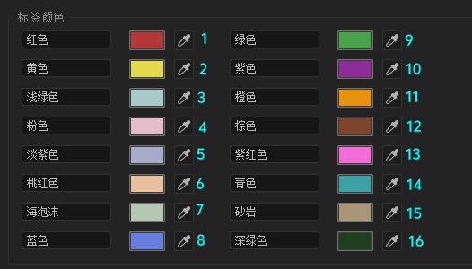

# 图层 —— Layer

:::tip
本章内容仍在逐步完善与更新中，更多精彩敬请期待！
:::


在上一章中，我们探讨了 `CompItem` 对象以及如何通过它来访问和管理图层。本章将深入剖析 `Layer` 对象本身。

若需查阅 `Layer` 对象的完整定义、属性及方法，请参考[接口文档](../api/AfterEffects/22.0/classes/Layer)。

### 图层类型解析

`Layer` 对象是多种具体图层类型的父类（或称基类），这意味着在 After Effects 中，图层以多种不同的形态存在。这些主要类型包括：

-   `LightLayer` (光源层)：用于在合成中创建和控制光源效果，为场景提供照明。
-   `CameraLayer` (摄像机层)：用于定义场景的观察视角、景深及其他摄像机相关属性。
-   `AVLayer` (Audio/Visual层，音/视觉层)：这是一个涵盖范围较广的图层类型，用于处理所有包含视觉或音频信息的内容。

值得注意的是，`AVLayer` 自身还可以进一步细分为更专门化的图层类型：

-   `TextLayer` (文本层)：专门用于创建、显示和编辑动态或静态的文本内容。
-   `ShapeLayer` (形状层)：用于绘制和控制矢量形状，例如矩形、圆形、椭圆、多边形以及自定义的贝塞尔路径。

本章的后续内容将重点介绍所有这些图层类型共有的 `Layer` 基类的核心属性与方法。基于面向对象的继承特性，所有具体的图层子类（如 `LightLayer`、`TextLayer` 等）都能够访问和使用这些通用的功能。


### 名称与标签颜色


和 `CompItem` 对象一样，`Layer` 对象也有 `name` 和 `label` 属性。

你可以通过 `Layer` 对象的 `name` 和 `label` 属性分别获取或设置图层的名称和标签颜色。

```ts
const comp = app.project.activeItem;

if (!(comp instanceof CompItem)) {
    throw new Error("当前项目没有合成");
}

const layer = comp.layer(1) // 选择第 1 层

layer.name = "咕咕嘎嘎" // 设置图层名称
```

值得一提的是，`label` 属性并非直接存储颜色值，而是通过一个 ID 来索引。这是因为 After Effects 允许用户自定义标签颜色，并提供了16个可供选择的标签 ID（这里示例中1代表红色）。

<center>

</center>
<center>标签颜色 ID 对照表</center>

<br/>
```ts
layer.label = 1 // 设置标签颜色为红色（ID 为 1）
```

### 禁用/启用图层

`Layer` 对象提供了 `enabled` 属性，用于控制图层是否显示在合成中。可以通过以下方式禁用或启用图层：

```ts
const comp = app.project.activeItem;

if (!(comp instanceof CompItem)) {
    throw new Error("当前项目没有合成");
}

const layer = comp.layer(1) // 选择第 1 层
layer.enabled = false; // 禁用图层
```

### 获取图层进入时间和结束时间

`Layer` 对象提供了 `inPoint` 和 `outPoint` 属性，用以获取或设置图层在时间线上的有效起始点与结束点。这些属性值均以秒为单位，并相对于合成（Composition）的参考时间（通常为 0 秒）进行计算。

关于进入时间，`startTime` 属性也提供了获取图层在合成中开始播放的具体时刻。

```ts
const layer = comp.layer(1) // 选择第 1 层

$.writeln(layer.inPoint); // 0
$.writeln(layer.outPoint); // 30
$.writeln(layer.startTime); // 0

layer.inPoint = 10; // 设置图层进入时间为 10 秒
layer.outPoint = 20; // 设置图层结束时间为 20 秒
```

### 获取当前时间指示器位置

`Layer` 对象拥有一个只读的 `time` 属性，它返回当前时间线指示器（CTI）在该图层自身时间坐标系中的位置。此属性值以秒为单位。

这个值反映了合成的当前时间（`comp.time`）在经过图层自身的 `startTime` 偏移、以及任何可能的时间重映射效果后的结果。

请注意，`time` 属性是只读的，无法直接赋值来改变图层的播放进度。

```ts
const layer = comp.layer(1) // 选择第 1 层

$.writeln(layer.time); // 15 (此值表示在合成当前时间点，图层播放到了其自身时间线的第15秒)

layer.time = 20; // 错误：time 属性只读
```

### 锁定图层

`Layer` 对象的 `locked` 属性是一个布尔值，用于控制该图层在 After Effects 用户界面中是否可被编辑。

```ts
const layer = comp.layer(1) // 选择第 1 层

layer.locked = true; // 锁定图层，防止编辑
layer.locked = false; // 解锁图层，允许编辑
```

### 消隐、独奏图层

`Layer` 对象提供了 `shy` 和 `solo` 这两个布尔属性，用以控制图层在时间线图层面板的显示状态和预览行为。

*   `shy`: 若设为 `true`，当合成的“隐藏所有消隐图层”开关激活时，此图层将在图层列表中被隐藏。
*   `solo`: 若设为 `true`，则只有此图层（以及其他同样被设为 `solo` 的图层）会被显示和渲染。

```ts
const layer = comp.layer(1) // 选择第 1 层

layer.shy = true; // 消隐图层 (在启用“隐藏所有消隐图层”时隐藏)
layer.shy = false; // 显示图层 (取消消隐状态)

layer.solo = true; // 独奏图层 (仅显示此图层及其他独奏图层)
layer.solo = false; // 取消独奏 (恢复正常显示逻辑)
```

### 获取图层的属性

`Layer` 对象的重要功能之一，便是通过其 `property()` （来自 `PropertyBase`）方法来访问和操作图层中形形色色的属性和属性组。


在 `ExtendScript` 中，`Property` 和 `PropertyGroup` 是两个至关重要的核心概念。你可以将 **`PropertyGroup` 理解为一个容器或文件夹**，它可以包含其他 `PropertyGroup` (形成嵌套结构) 或者直接包含具体的 **`Property` (即独立的、可控制的属性值)**。这种机制被 After Effects 广泛用于组织和管理图层的海量参数。一个重要的事实是，**`Layer` 对象本身就继承自 `PropertyGroup`**，这意味着一个图层本身就是一个顶级的属性容器。

在 After Effects 的具体应用中：
*   **`PropertyGroup` (属性组)**：通常代表一类相关属性的集合，例如“变换 (Transform)”属性组就包含了位置、旋转、缩放等属性；“效果 (Effects)”属性组会包含应用于图层的各个效果，每个效果本身也可能是一个属性组。
*   **`Property` (属性)**：代表一个具体的可直接修改的参数，比如“不透明度 (Opacity)”属性、“位置 (Position)”属性等。这些是构成动画和视觉效果的基本单元。

因此，图层的各种特性，包括但不限于变换、蒙版、标记、时间重映射、效果等，都是通过这种 `PropertyGroup` 包含 `Property` (或更多 `PropertyGroup`) 的层级结构来存储和管理的。

```ts
const layer = comp.layer(1); // 选择第一个图层

// 注意：按索引访问不够稳健，因为属性组的顺序可能变化或因图层类型而异，更推荐按名称访问。
const prop = layer.property(1);
```

`property()` 方法是探索和控制图层细节的关键入口。它返回的对象属于 `_PropertyClasses` 联合类型，这意味着其具体类型可能是 `Property`（一个具体的属性）、`PropertyGroup`（一个属性的集合/文件夹）或专门的 `MaskPropertyGroup`（蒙版属性组）。

正是这种设计，构成了 After Effects 中层层嵌套的属性结构。例如，一个 `Layer` (本身是 `PropertyGroup`) 可能包含名为“效果 (Effects)”的 `PropertyGroup`，这个“效果”组里面又可能包含名为“高斯模糊”的 `PropertyGroup`，而“高斯模糊”组里面则有一个名为“模糊度 (Blurriness)”的 `Property`。

因此，当你使用 `property()` 方法获取一个对象后，如果它是 `_PropertyClasses` 联合类型中的 `PropertyGroup`，你就可以继续对它使用 `property()` 方法来访问其内部的属性或子属性组。

由于返回的是联合类型，和你之前遇到的情况一样，你需要借助类型判断来明确你正在操作的是一个具体的 `Property` 还是一个 `PropertyGroup`，以便调用对应类型所特有的方法和属性。

```ts
const layer = comp.layer(1) // 选择第 1 层

const effects = layer.property("Effects"); // 获取图层的效果属性组

// 检测是否是 PropertyGroup，以及是否为空
if (!(effects instanceof PropertyGroup) || !effects) {
    throw new Error("不是属性组");
}

let numProps = effects.numProperties; // 由于 numProperties 是 PropertyGroup 的属性，
// 上面指定了类型、并判断了是否是 PropertyGroup，现在你可以调用它了
```

`property()` 方法也支持使用属性的名称字符串作为参数，以获取特定的属性对象。

```ts
const layer = comp.layer(1) // 选择第 1 层

const transform = layer.property("Transform"); // 获取图层的变换属性组
const effects = layer.property("Effects"); // 获取图层的效果属性组

let effectName = effects.property(1).name; // 获取图层的第 1 个效果属性的名称
```

当然，在相应语言版本的 After Effects 中，你也可以尝试使用本地化名称：

```ts
const layer = comp.layer(1) // 选择第 1 层

const transform = layer.property("变换"); // 在中文版 AE 中获取图层的变换属性组
```

**兼容性提示：** 考虑到脚本的跨语言环境兼容性，强烈建议在脚本中优先使用属性的**英文名称**。这能确保脚本在不同语言版本的 After Effects 中均能稳定运行。或者，使用属性的 `matchName` (一个不受语言影响的内部唯一标识符)。

```ts
const layer = comp.layer(1) // 选择第 1 层

const transform = layer.property("变换"); // 获取图层的变换属性组
let tfMatchName = transform.matchName; // ADBE Transform Group

const transofrmAdbe = layer.property("ADBE Transform Group"); // 你也可以通过 matchName 直接获取属性

let tfNameAdbe = transofrmAdbe.name; // 变换
let tfName = transform.name; // 变换
```

### 获取图层的效果

`Layer` 对象提供了 `effect` 方法，用于获取图层的效果属性组。

```ts
const layer = comp.layer(1) // 选择第 1 层

const effect = layer.effect(1) // 获取图层的第 1 个效果属性组
```

### 获取图层的属性数量

`Layer` 对象提供了 `numProperties` 属性，用于获取图层中属性的数量。

```ts
const layer = comp.layer(1) // 选择第 1 层

const numProps = layer.numProperties; // 获取图层属性的数量
```

你可以通过 `for` 循环 `numProperties`，来做到输出图层中所有属性的名称。

```ts
const layer = comp.layer(1) // 选择第 1 层

// 不是从 0 开始，是从 1 开始
for (let i = 1; i <= layer.numProperties; i++) {
    const prop = layer.property(i);
    $.writeln(prop.name);
}
```

### 获取图层的变换属性组

`Layer` 对象提供了一个 `transform` 属性，通过它可以访问图层的变换属性组 (Transform Group)。

这个 `transform` 属性的类型是 `_TransformGroup`，它继承自 `PropertyGroup`。顾名思义，它包含了图层的核心变换属性，例如位置 (Position)、缩放 (Scale)、旋转 (Rotation) 等。

```ts
const layer = comp.layer(1); // 选择合成中的第一个图层
const transform = layer.transform; // 获取该图层的变换属性组
```

### 获取和修改图层位置

在变换属性组中，`position` 属性专门用于控制图层的位置。它的类型是 `TwoDOrThreeDProperty`，这意味着它可以存储二维 (2D) 或三维 (3D) 的坐标数据。

这一点揭示了“属性 (Property)”对象的一个重要特性：不同属性组下的具体属性（如位置、缩放等）可能拥有不同的数据类型和内部结构。理解这些差异对于精确操控图层属性至关重要。

因此，要想自如地读取或修改这些图层属性，深入理解 `Property` 对象及其各种派生类型（如 `TwoDOrThreeDProperty`）的概念和用法是必不可少的。

我们将在下一章节中，对 Property 和 PropertyGroup 的相关知识进行一次解剖 API 接口式的详细探讨，之后才会介绍如 AVLayer、CameraLayer 等特定类型的图层。

**特别注意**：你不能直接通过 `position.value = newValue` 的方式来修改位置属性的值，因为 `value` 属性本身是只读的。要修改属性值，必须使用 `Property` 对象提供的 `setValue()` 方法。

即便图层本身不是 3D 图层（其3D开关未开启），`position` 属性的 `value` 仍然会返回一个包含三个元素（X, Y, Z）的数组，其中 Z轴（第三个维度）的值默认为 0。

```ts
const layer = comp.layer(1); // 再次选择第一个图层
const transform = layer.transform; // 获取变换属性组
const position = transform.position; // 获取图层的位置属性

// 修改位置属性
position.setValue([100, 200, 0]); // 将位置设置为 [100, 200, 0]

// 下面这行代码会产生错误，因为 .value 是只读的
// position.value = [100, 200, 0]; // After Effects错误: 无法设置“value” 。它是 readOnly 属性。
```

当然，如果希望创建动画，让图层“动起来”，`Property` 对象还提供了 `setValueAtTime()` 方法。此方法允许你在特定的时间点设置属性值，从而创建关键帧。

一旦使用 `setValueAtTime()` 为某个属性在特定时间点设置了值，After Effects 中该属性对应的时间变化秒表（Stopwatch）会自动激活，表示该属性已启用关键帧动画。

```ts
position.setValueAtTime(
    1, // 时间点，单位为秒
    [100, 200, 0] // 该时间点对应的属性值
); // 在 1 秒处将位置设置为 [100, 200, 0]
```


### 获取图层的蒙版属性组

`Layer` 对象提供了 `mask` 属性，用于获取图层的蒙版属性组。

```ts
const layer = comp.layer(1) // 选择第 1 层

const mask = layer.mask; // 获取图层的蒙版属性组
```

### 获取图层的标记属性组

### 复制图层

`Layer` 对象提供了 `duplicate()` 方法，用于复制当前图层，并返回新图层的引用。

```ts
const layer = comp.layer(1) // 选择第 1 层

const newLayer = layer.duplicate(); // 复制当前图层
```

### 移除图层

`Layer` 对象提供了 `remove()` 方法，用于从合成中移除当前图层。

```ts
const layer = comp.layer(1) // 选择第 1 层

layer.remove(); // 从合成中移除当前图层
```